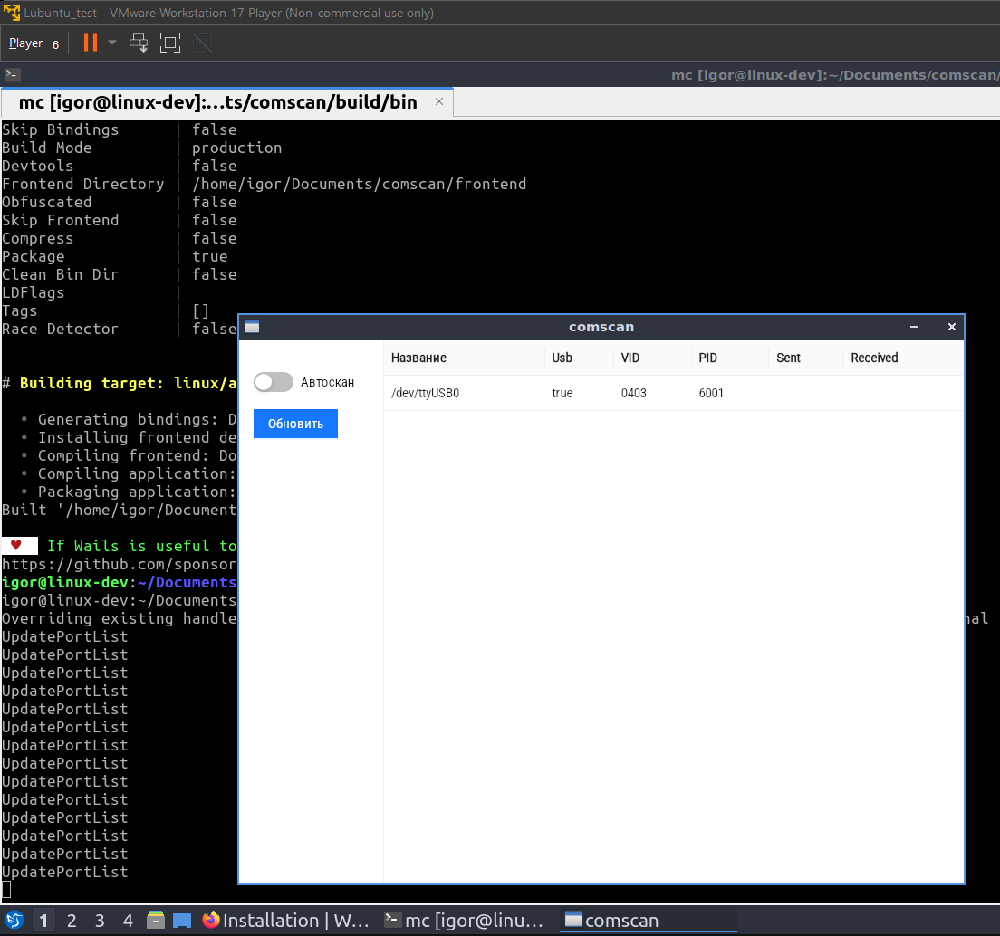
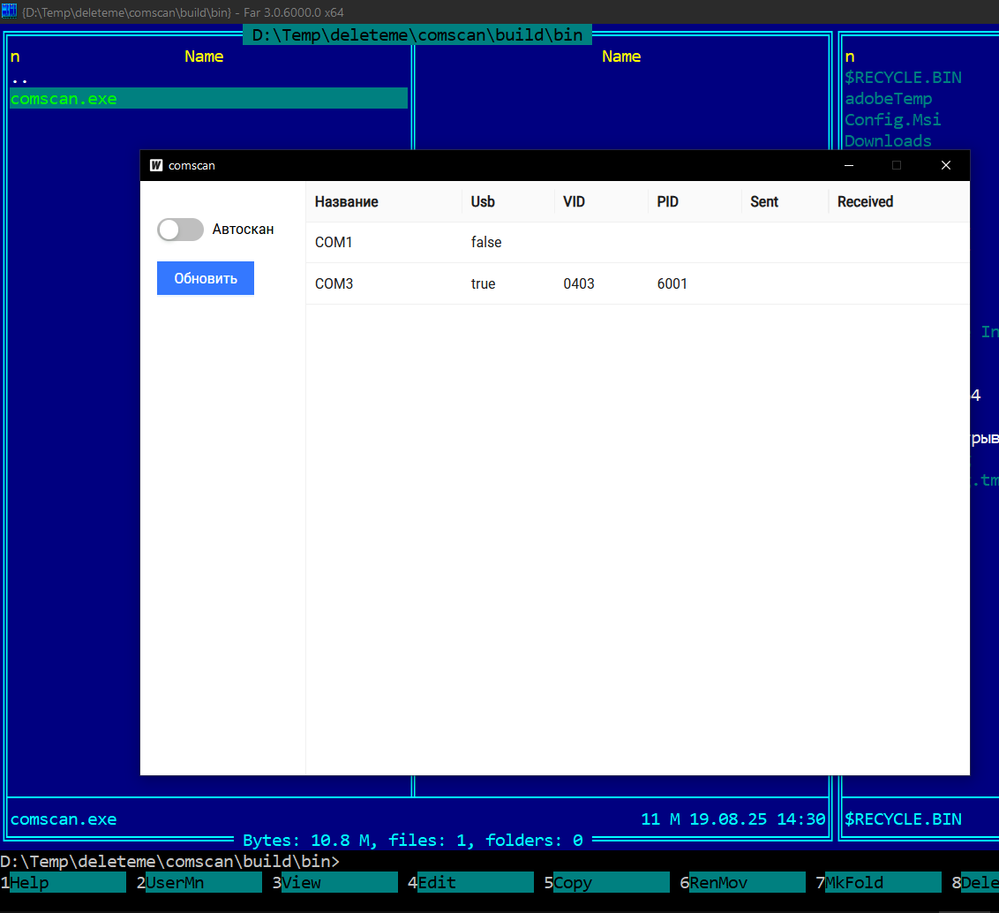

# comscan
## About
На фронте React + antd для UI.  
На бэке реализована мока, которая используется в юнит-тестах.  
Эта же мока закомментирована в `main.go`: можно раскомментировать и вручную проверить UI для различных сценариев.  

Разработано на Windows.  
Кросскомиляцию Windows->Linux выполнить не удалось: Wails написал, что не поддерживается.  
Проверил сборку в виртуалке на Lubuntu.  

 
 
## Build
`npm run build`
